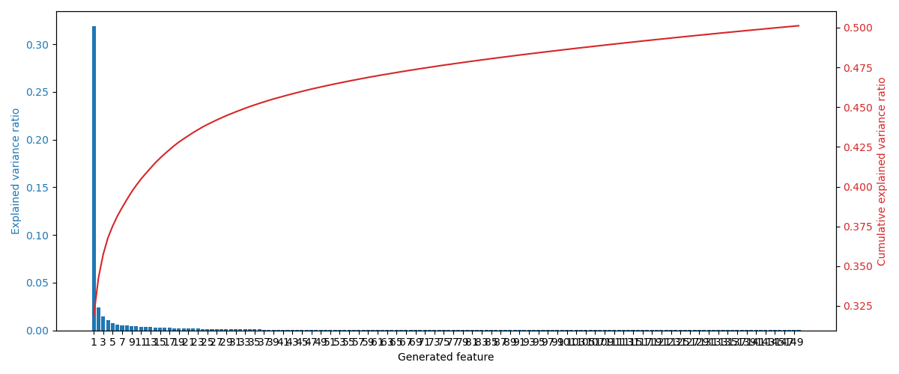
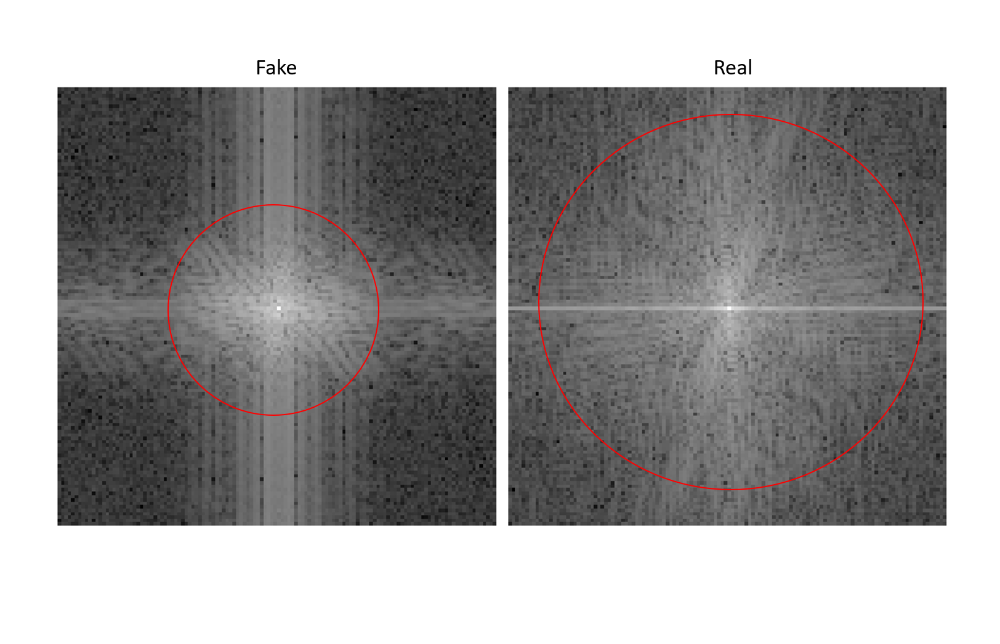

# Deepfake detection via Fourier Transform
This is the official Repo for the Deepfake detection project in the ML course

### Installation

To install packages, install via ```requirements.txt``` file via command:

```
pip install -r requirements.txt
```

All of the packages will be installed.

### Run the training

To run the training, please use ```train.py``` file, via command:

```
python train.py
```

You will see logs, and training, testing results on the console.

### Predict

To run the prediction, please use ```predict.py``` file, via command:

```
python predict.py
```

The model file and pca pickle file are saved at ```models/``` directory.

### PCA analysis

To analyze the choice of the component we do the correlation visualization below:

<div align="center">
    <a href="./">
        
    </a>
</div>

This is the graph when we choose with ```n_components = 15```, although information can be loss, but it is in the acceptable range.

### FFT analysis

To analyze the FFT feature, we do the visualization of the real and fake images in frequency domain, as its demonstration, the real image has the better spectrum than the fake image.

<div align="center">
    <a href="./">
        
    </a>
</div>